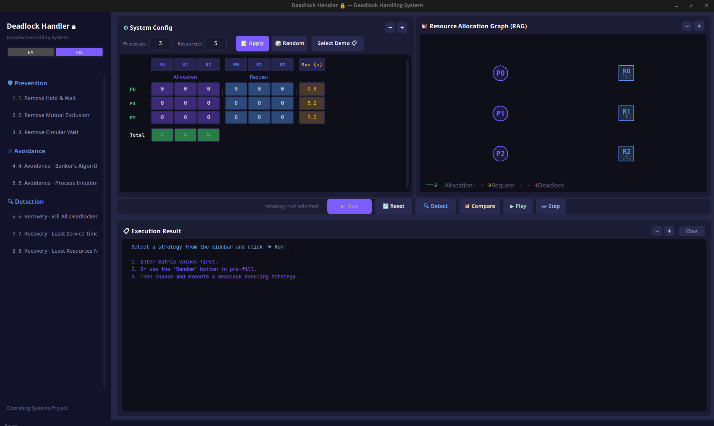
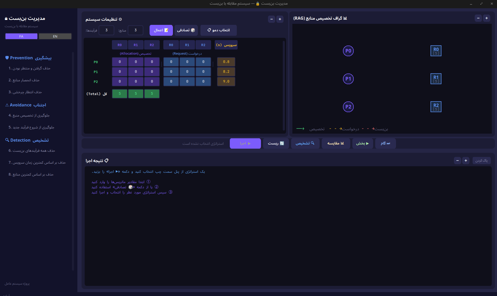

# شبیه‌ساز پیشرفته مدیریت بن‌بست سیستم‌عامل (Advanced Deadlock Management Simulator)

این پروژه یک شبیه‌ساز گرافیکی و تعاملی است که برای پیاده‌سازی و بررسی رفتار سیستم‌عامل در مواجهه با مشکل بن‌بست (Deadlock) طراحی شده است. 

در این برنامه، کاربر می‌تواند ماتریس‌های تخصیص (Allocation) و درخواست (Request) مربوط به فرآیندها و منابع را به دلخواه مقداردهی کند (یا از حالت‌های تصادفی و آماده استفاده نماید). سپس می‌تواند یکی از ۸ استراتژی‌ مختلف مقابله با بن‌بست(شامل روش‌های پیشگیری، اجتناب، تشخیص و بازیابی) را انتخاب و روی سیستم اجرا کند. در نهایت، برنامه روند اجرای هر الگوریتم را به صورت گام‌به‌گام در قالب متن و همچنین از طریق رسم «گراف تخصیص منابع (RAG)» به تصویر می‌کشد.

---

### تصاویر محیط برنامه

**رابط کاربری انگلیسی**

**رابط کاربری فارسی:**

---
## ویژگی‌های برجسته نرم‌افزار

*   **رابط کاربری گرافیکی مدرن (GUI):** طراحی جذاب و کاربرپسند با استفاده از `CustomTkinter`.
*   **گراف تخصیص منابع (RAG) هوشمند:** رسم لحظه‌ای گراف منابع به همراه **تشخیص بصری چرخه‌های بن‌بست** (یال‌های درگیر در بن‌بست به رنگ قرمز در می‌آیند).
*   **موتور شبیه‌سازی پویا (Dynamic Simulation Engine):** امکان اجرای پیوسته (Play)، توقف (Pause) و اجرای گام‌به‌گام (Step) برای مشاهده انیمیشنی روند تخصیص و آزادسازی منابع تا اتمام فرآیندها.
*   **داشبورد مقایسه آماری (Comparison Panel):** اجرای تمامی الگوریتم‌ها به صورت یکجا بر روی وضعیت فعلی سیستم و نمایش نتایج و کارایی آن‌ها در قالب **نمودارهای میله‌ای رنگی (توسط Matplotlib)**.
*   **سیستم زوم مستقل:** امکان بزرگ‌نمایی اختصاصی (Zoom in/out) برای پنل تنظیمات ماتریس‌ها، پنل گراف RAG و خروجی گزارش‌ها به‌صورت مستقل بدون بهم ریختن ظاهر کلی برنامه.
*   **پشتیبانی دو زبانه (انگلیسی و فارسی):** تغییر زبان در لحظه با رندر دقیق متون راست‌به‌چپ (RTL) و حروف متصل فارسی.

---

## 📖 راهنمای استفاده از برنامه (گام‌به‌گام)

### ۱. مقداردهی اولیه سیستم
در پنل **تنظیمات سیستم**، می‌توانید ساختار پایه‌ای سیستم را تعریف کنید:
۱. **تعداد فرآیندها (Processes) و منابع (Resources)** را وارد کنید.
۲. روی دکمه **اعمال** کلیک کنید تا ماتریس‌ها ساخته شوند.
۳. ماتریس تخصیص (Allocation) و ماتریس درخواست (Request) و همچنین کل منابع موجود (Total) و زمان سرویس هر پروسه (Svc Time) را با اعداد پر کنید.
* *نکته:* می‌توانید برای سادگی روی دکمه **تاس (تصادفی)** کلیک کنید یا از منوی **انتخاب دمو** (بالای پنل)، یک حالت آماده (مثبت، بن‌بست، یا انتظار چرخشی) را در سیستم بارگذاری کنید.
* *ابزار زوم:* با استفاده از دکمه‌های `+` و `-` در هدر همین پنل، می‌توانید اندازه خانه‌های ماتریس را برای خوانایی بهتر تغییر دهید.

### ۲. انتخاب استراتژی مدیریت بن‌بست
از منوی کناری (Sidebar) سمت چپ صفحه، یکی از ۸ استراتژی موجود (در دسته‌های پیشگیری، اجتناب، تشخیص و بازیابی) را انتخاب کنید. با کلیک روی هر کدام، عنوان آن استراتژی در نوار ابزار اصلی (پایین پنل تنظیمات) ثبت می‌شود.

### ۳. کنترل اجرا
پس از انتخاب استراتژی، از طریق نوار ابزار میانی کنترل اجرای الگوریتم‌ها در دستان شماست:
*   **اجرا (Run):** الگوریتم انتخاب شده را فقط برای یک مرحله منطقی اجرا می‌کند (مثلاً فقط تشخیص بن‌بست، یا کشتن یک پروسه). نتیجه در پنل «نتیجه اجرا» (Log) گزارش داده می‌شود.
*   **پخش / توقف (Play / Pause):** با زدن این کلید، **موتور شبیه‌سازی پویا** روشن می‌شود. سیستم در فواصل زمانی کوتاه، به طور مداوم تلاش می‌کند منابع را با استفاده از الگوریتم بانکدار (Banker) به فرآیندها تخصیص دهد. فرآیندهایی که درخواستشان برآورده می‌شود، اجرا شده، منابع خود را پس می‌دهند و با رنگ سبز مشخص می‌شوند. اگر سیستم در بن‌بست باشد، شبیه‌ساز متوقف می‌شود و به شما هشدار می‌دهد.
*   **گام‌به‌گام (Step):** دقیقاً مانند دکمه Play عمل می‌کند اما فقط **یک فریم/چرخه** از شبیه‌ساز را جلو می‌برد. مناسب برای درک عمیق‌تر از اتفاقاتی که در پس‌زمینه می‌افتد.
*   **تشخیص (Detect):** فارغ از اینکه چه استراتژی‌ای انتخاب شده باشد، سیستم را فوراً بررسی می‌کند تا ببیند بن‌بست رخ داده است یا خیر.
*   **مقایسه 📊 (Compare):** یک پنجره گرافیکی باز می‌کند که در آن هر ۳ استراتژی ریکاروی سیستم روی حالت فعلی تست شده و تعداد پروسه‌های کشته شده در برابر پروسه‌های موفق در نمودار میله‌ای مقایسه می‌شوند.
*   **ریست (Reset):** وضعیت سیستم را به قبل از اجرای الگوریتم برمی‌گرداند تا بتوانید تست‌های دیگری انجام دهید.

---

## 🧠 تشریح الگوریتم‌های مدیریت بن‌بست در برنامه

بن‌بست (Deadlock) زمانی رخ می‌دهد که مجموعه‌ای از فرآیندها در انتظار منابعی باشند که توسط یکدیگر اشغال شده‌اند (ایجاد یک دور باطل). راهکارهای مدیریت بن‌بست به چهار دسته اصلی تقسیم می‌شوند که همگی در این نرم‌افزار پیاده‌سازی شده‌اند:

### الف) پیشگیری از بن‌بست (Deadlock Prevention)
استراتژی پیشگیری تلاش می‌کند تا با تضمین اینکه **حداقل یکی از چهار شرط اصلی بن‌بست (Coffman Conditions) هرگز برقرار نشود**، از وقوع بن‌بست جلوگیری کند.

۱. **حذف "گرفتن و منتظر بودن" (Hold & Wait Prevention):**
   * *توضیح:* در این روش به سیستم اجازه داده نمی‌شود فرآیندی که منبعی را در اختیار دارد، برای منبع دیگری منتظر بماند.
   * *پیاده‌سازی در برنامه:* برنامه چک می‌کند آیا فرآیندی وجود دارد که درخواست جدیدی ثبت کرده اما از قبل منبعی در اختیار دارد (Allocation > 0). اگر چنین باشد، سیستم تمام منابع قبلی فرآیند را از آن پس‌می‌گیرد (اجبار به آزادسازی) تا فرآیند مجبور شود بعداً همه منابع را با هم درخواست کند.

۲. **حذف "انحصار منابع" (Mutual Exclusion Prevention):**
   * *توضیح:* برخی منابع ذاتاً انحصاری هستند (مثل پرینتر)، اما اگر سیستم بتواند منابع را به طور مجازی (مثلاً از طریق Spooling) غیرانحصاری کند بن‌بست رخ نمی‌دهد.
   * *پیاده‌سازی در برنامه:* در این شبیه‌سازی، برنامه به صورت نمادین تمامی درخواست‌های معلق برای منابع را با تظاهر به نامحدود بودن و اشتراکی شدن ظرفیت آن‌ها (Zeroing Requests) لغو می‌کند و هشدار می‌دهد که این کار در عمل برای برخی سخت‌افزارها غیرممکن است.

۳. **حذف "انتظار چرخشی" (Circular Wait Prevention):**
   * *توضیح:* در این روش، به هر منبع یک شناسه یا شماره تعلق می‌گیرد. فرآیندها تنها مجازند منابع را به ترتیب صعودی درخواست کنند.
   * *پیاده‌سازی در برنامه:* اگر فرآیندی منبعی با شماره بزرگتر در اختیار داشته باشد (مثلاً R2) و حالا منبعی با شماره کوچکتر درخواست کند (مثلاً R0)، الگوریتم درخواست او را به عنوان "تخلف از ترتیب" غیرمجاز می‌داند و فرآیند را Abort می‌کند.

### ب) اجتناب از بن‌بست (Deadlock Avoidance)
در این رویکرد، سیستم قبل از دادن منابع به فرآیندها، وضعیت آینده را پیش‌بینی می‌کند (معمولاً با استفاده از الگوریتم بانکدار - Banker's Algorithm) تا مطمئن شود سیستم در **حالت امن (Safe State)** باقی می‌ماند.

۴. **جلوگیری از تخصیص منبع ناامن:**
   * *توضیح:* سیستم بررسی می‌کند که آیا با دادن این منابع به فرآیند، آیا مسیری برای تکمیل تمام فرآیندها باقی می‌ماند یا خیر.
   * *پیاده‌سازی در برنامه:* اگر درخواستی وجود داشته باشد که منجر به حالت ناامن و بن‌بست شود، سیستم تخصیص را لغو می‌کند.

۵. **جلوگیری از شروع فرآیند جدید:**
   * *توضیح:* اگر مجموع درخواست‌های یک فرآیند جدید از کل منابع سیستم تجاوز کند، اصلاً نباید وارد سیستم شود.
   * *پیاده‌سازی در برنامه:* فرآیندهایی که سرجمع درخواستشان از منابع Available در بدترین حالت بیشتر باشد، شناسایی شده و اجازه شروع نمی‌گیرند.

### ج) تشخیص و بازیابی از بن‌بست (Deadlock Detection & Recovery)
اگر سیستم کاری برای پیشگیری یا اجتناب نکند، بن‌بست اتفاق می‌افتد. در این حالت سیستم باید بتواند فرآیندهای گیر کرده در چرخه‌ی بن‌بست را شناسایی کند (الگوریتم تشخیص کاهش گراف) و سپس برای بازیابی، چرخه را از طریق قربانی کردن (Kill/Preempt) فرآیندها بشکند. برنامه ۳ استراتژی ترکیبی برای این کار ارائه می‌دهد:

۶. **تشخیص بن‌بست و حذف همه فرآیندهای در بن‌بست:**
   * *توضیح:* خشن‌ترین و سریع‌ترین راه. پس از تشخیص بن‌بست، تمامی فرآیندهایی که در چرخه بن‌بست گیر کرده‌اند همزمان Abort می‌شوند و تمام منابعشان پس گرفته می‌شود.

۷. **تشخیص بن‌بست و حذف فرآیندها به ترتیب کمترین زمان سرویس تا کنون:**
   * *توضیح:* پس از تشخیص بن‌بست، فرآیندی که کمترین زمان را پردازنده گرفته است به عنوان قربانی انتخاب می‌شود تا کمترین کار از دست برود.
   * *پیاده‌سازی در برنامه:* برنامه از بین فرآیندهای بن‌بست، فرآیندی را پیدا می‌کند که پارامتر `Svc Time` آن کمترین مقدار باشد و فقط آن را حذف می‌کند. سپس گراف رفرش شده و اگر همچنان بن‌بست پابرجا بود، الگوریتم مجدد اجرا می‌شود تا چرخه کاملاً بشکند.

۸. **تشخیص بن‌بست و حذف فرآیندها براساس کمترین منابع مورد نیاز:**
   * *توضیح:* پس از تشخیص بن‌بست، فرآیندی قربانی می‌شود که کمترین منابع را در اختیار دارد، بنابراین هزینه (Penalty) پس گرفتن منابع آن کمتر است.
   * *پیاده‌سازی در برنامه:* سیستم مجموع منابع در اختیار هر فرآیند در بن‌بست را حساب می‌کند ($\sum \text{Allocation}_i$) و فرآیندی که کمترین مجموع را داشته باشد، نابود می‌کند.
